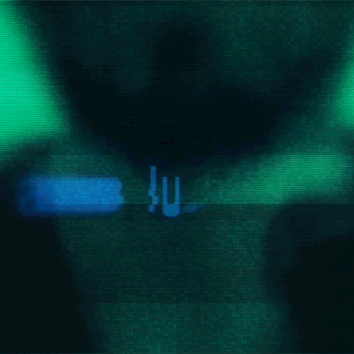

# 🤖 Imersão Inteligência Artificial 2ª Edição 🤖

  

Repositório contendo o material utilizado no curso de Imersão Inteligência Artificial 2ª Edição, oferecido pela [Alura](https://cursos.alura.com.br/imersao).

## Conteúdo

O curso inclui:

- Introdução à Inteligência Artificial
- Fundamentos de Machine Learning
- Pré-processamento de Dados
- Modelagem de Dados
- Avaliação de Modelos
- Aplicações Práticas de IA

## Autores do Curso

O curso foi desenvolvido por especialistas em IA da Alura em colaboração com especialistas do Google: [Fabrício Carraro](https://www.linkedin.com/in/fabriciocarraro/), [Paulo Silveira](https://www.linkedin.com/in/paulosilveira/), [Ana Raquel](https://www.linkedin.com/in/ana-raquel-fernandes-cunha-a48a07a0/) e [Luciano Martins](https://www.linkedin.com/in/lucianommartins/).
