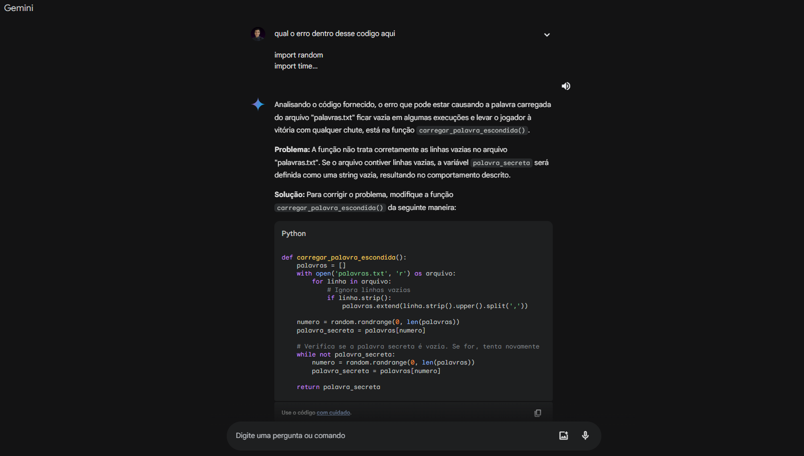
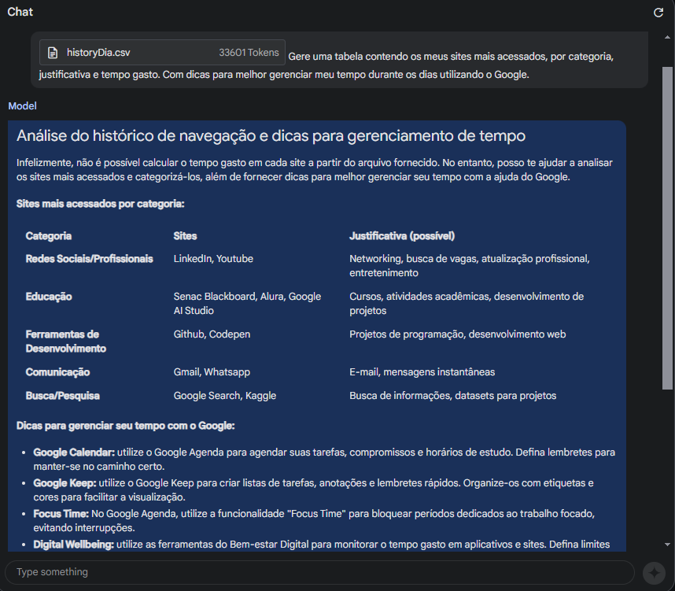

# Aula 1: Introdução ao Gemini, a IA do Google

## Desafios

### Desafio 1: Automatizar um processo do cotidiano com o Gemini ou o Google AI Studio

Na aula 1 foi proposto um desafio de utilizar as ferramentas de IA do Google para automatizar algum processo do cotidiano. Isso pode incluir tarefas repetitivas ou que demandem muito tempo, como a criação de relatórios, a análise de dados, a geração de textos, entre outros.

Utilizei de forma bem simples, como normalmente uso para entender onde está o erro de um código para um trabalho da faculdade de TI. 
Fiquei surpreendido pela acurácia da IA por ser a única que conseguiu solucionar o problema que estive enfrentando.

### Desafio 2: Análise do Histórico do Google Chrome com o Google AI Studio

Utilize a extensão [Quick Chrome History Export](https://chromewebstore.google.com/detail/quick-chrome-history-expo/hdfpifhfphhgjipcnfnolgalplokmmge) para exportar o histórico de navegação do Google Chrome e analise os dados, gerando insights. 

Como curiosiade, pedi para a IA gerar uma tabela contendo os meus sites mais acessados, por categoria, justificando o motivo de ter acessado tanto. E dicas para melhorar a produtividade.

