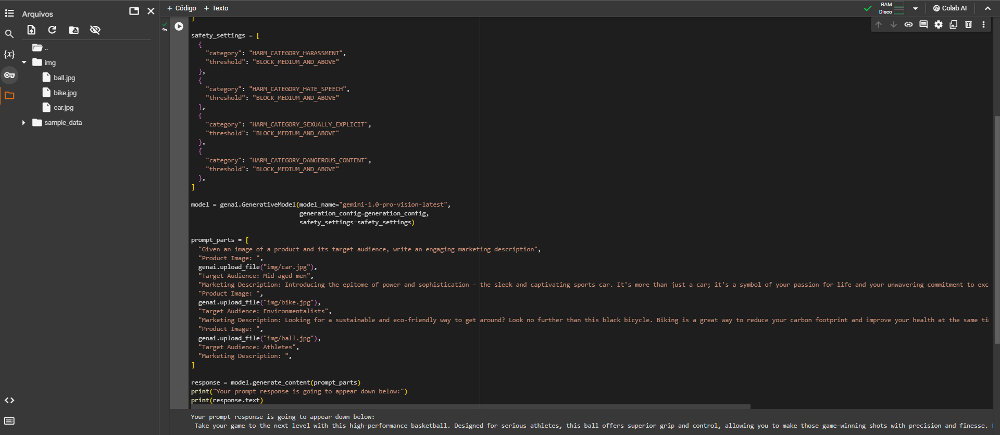

# Aula 03: Explorando os parâmetros do Google AI Studio

## Desafios

1. Crie um áudio e realizar um prompt para que a IA descreva o que está ouvindo.

Para este desafio, decidi aplicar em algo útil e que possa ajudar no dia a dia de professores. Utilizei um áudio de dois minutos de uma aula em Inglês sobre Fundamentos de Redes de Computadores, onde a IA descreve o que está ouvindo e transcreve o áudio para texto em Português. Com isso é possível transformar o conhecimento em outro idioma para o seu idioma nativo e organizar melhor o conteúdo para afins de apresentação.

2. Pesquisar como integrar a imagem do Google AI Studio dentro do Google Colab para o código Python.

## Material de Apoio para estudo

### Tokens e PLN (Processamento de Linguagem Natural)
- Tokens são as unidades básicas de um texto, como palavras, números, pontuações, etc. Para serem processadas, há uma etapa de tokenização, que consiste em dividir o texto em tokens e remover caracteres indesejados, assim economizando espaço e tempo de processamento. 
- O PLN é uma subárea da IA que estuda a interação entre computadores e humanos por meio da linguagem natural. Ele é responsável por processar e analisar textos, traduzir idiomas, responder perguntas, entre outras tarefas.

### Parâmetros
- O Google AI Studio conta com 3 parâmetros principais: Top K, Top P e Temperatura.
- Top K: controla a quantidade de tokens que o modelo considera para a próxima palavra. Quanto maior o valor, mais diversificada será a resposta.
- Top P: controla a probabilidade acumulada de tokens que o modelo considera para a próxima palavra. Quanto maior o valor, mais diversificada será a resposta.
- Temperatura: controla a aleatoriedade da amostra. Quanto maior o valor, mais aleatória será a resposta.

## Tipos de Prompts do Google AI Studio
- O Google AI Studio conta com 3 tipos de prompts: 
    - Chat prompts: são prompts que simulam uma conversa com a IA.
    - Freeform prompts: são prompts que permitem que o usuário escreva livremente.
    - Structured prompts: são prompts que seguem uma estrutura específica, como perguntas e respostas em tabelas organizadas. 